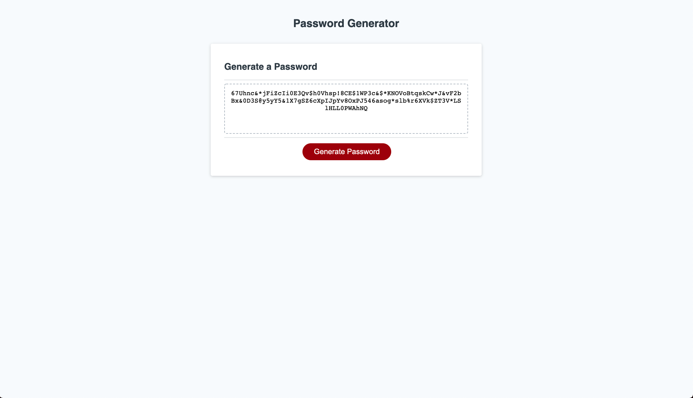

# Password Generator

## Summary

The goal of this project is to create a password generator that will randomly generate a password based on criteria which the user selects.

---

## Details

* Password generated is of a length between 8 and 128 characters inclusive of 8 and 128.
* The user can select whether to add lower case letters, upper case letters, numbers, and/or special characters. The user must select at least 1 of these options.
* The user can also select the length of the password(between 8 and 128 characters inclusive).

---

## Method to generate password

1. Initial arrays with possible characters are set up. One array for each character type: lower case letters, upper case letters, numbers, and special characters.
2. User input is taken to determine which types of characters they want to use and determine the length of password they want.
3. Based on the users choices the applicable arrays are concatenated and joined into a string containing all characters the user chose.
4. Charaters are then pulled at random from this string and concatenated to create a random password.
5. This password is then shown to the user on the screen and can be copied directly from the text box.

---

## Live Site

Link to the live site [here.](https://seanovery.github.io/password-generator/)

---

## Preview

